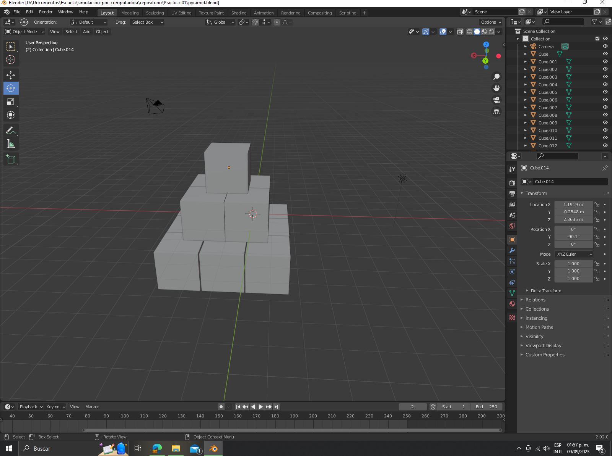
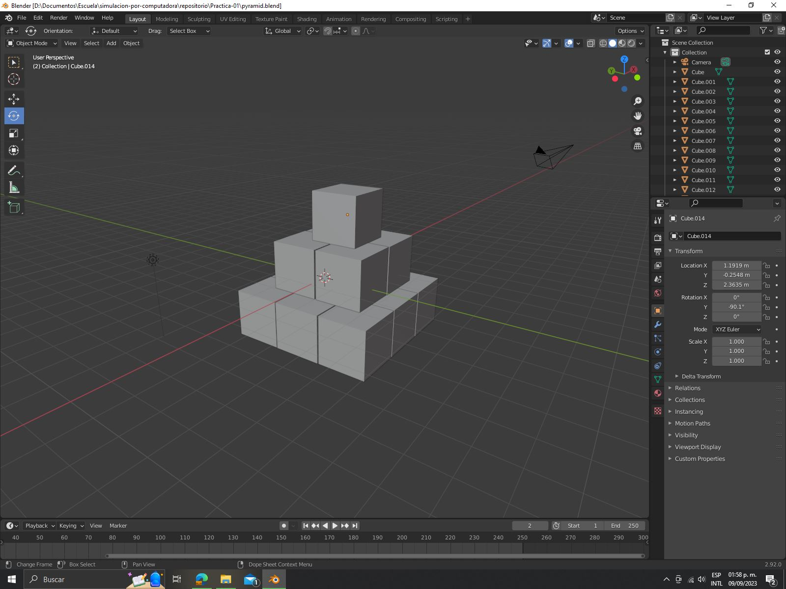

# Práctica 2: Piramide de cubos
En este apartado se muestra el desarrollo de la primera práctica.

Consta de una introducción a blender, haciendo uso de comandos básicos.

El resultado final es una piramide sencilla.

## Evidencia 1

## Evidencia 2

