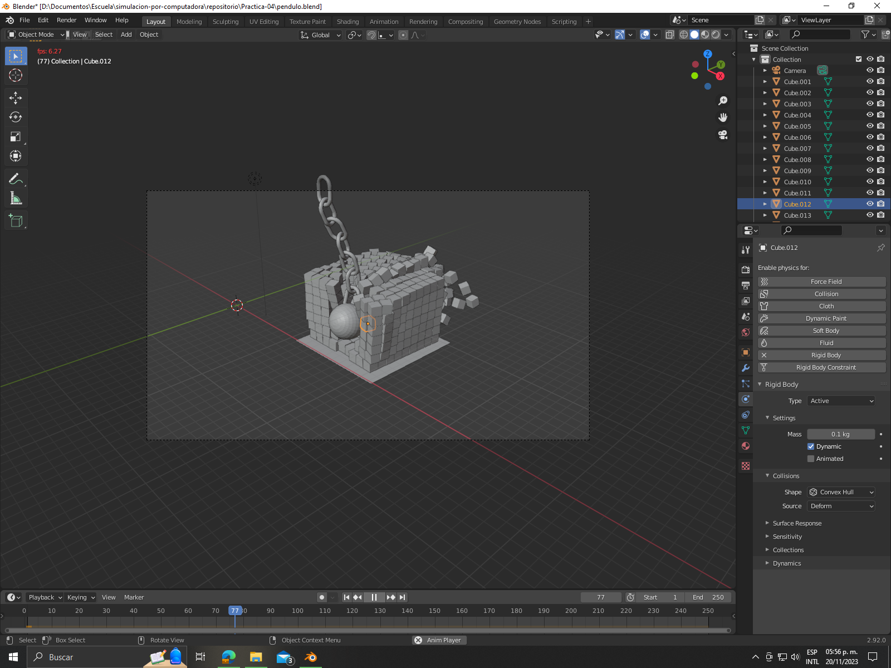
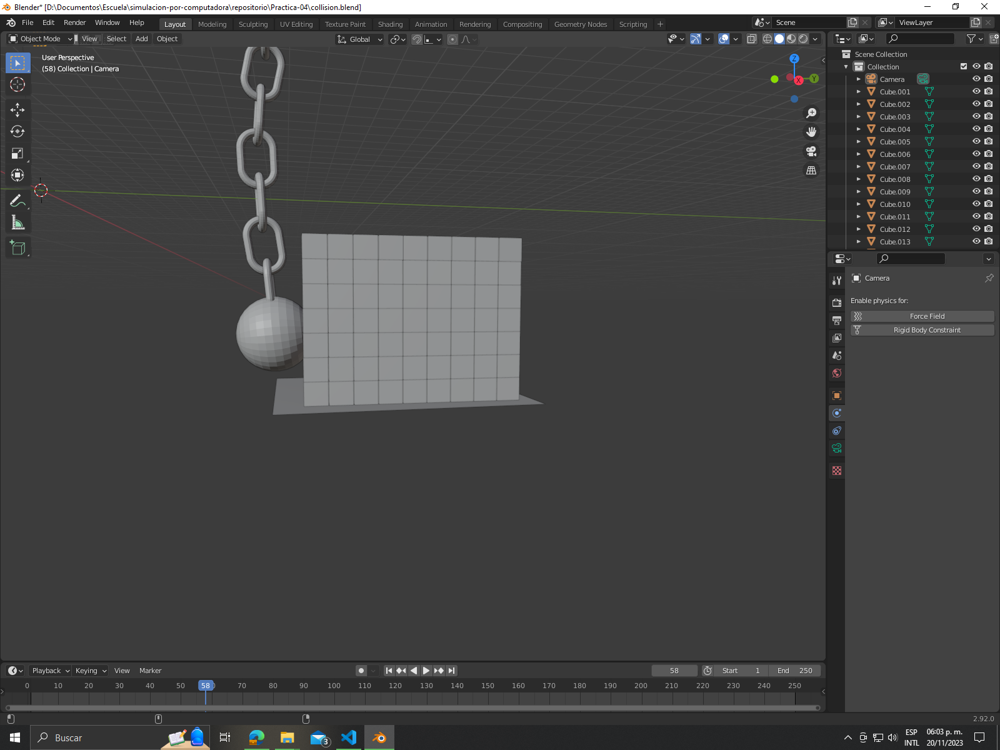

# Práctica 4: Simulación colisión
En este apartado se muestra el desarrollo de la cuarta práctica que consiste en la creación de una escena donde se desarrolla una colisión usando recursos como la elaboración de una malla y la aplicación de fisícas, así como de los manejos de la colisión.

## Evidencia 1

## Evidencia 2
