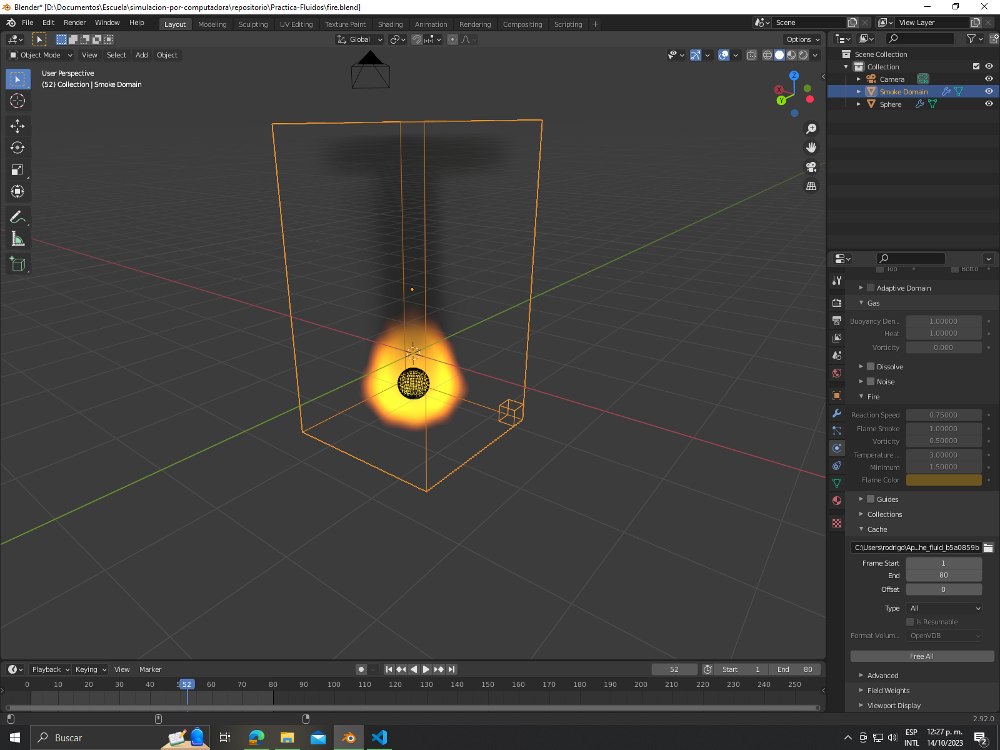
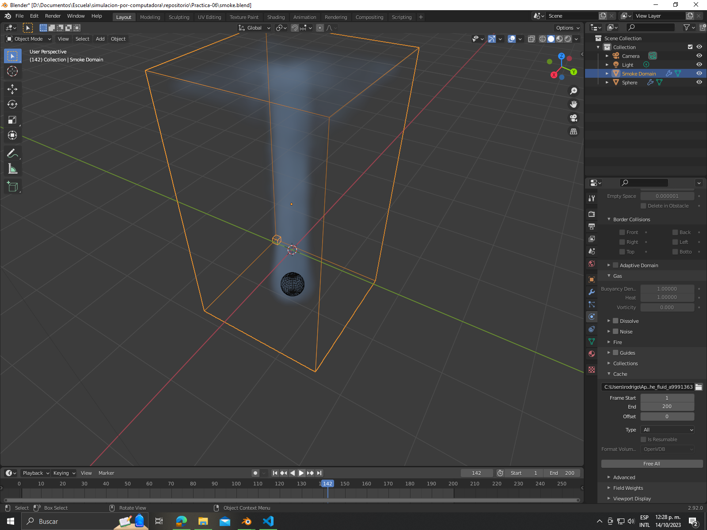

# Práctica 6: Simulación humo y fuego
En este apartado se muestra el desarrollo de la cuarta práctica que consiste en la creación de la simulación del fluido humo y humo + fuego bajo el uso de poligonos.

A continuación se muestran las evidencias del desarrollo de la práctica.

## Evidencia 1

## Evidencia 2
