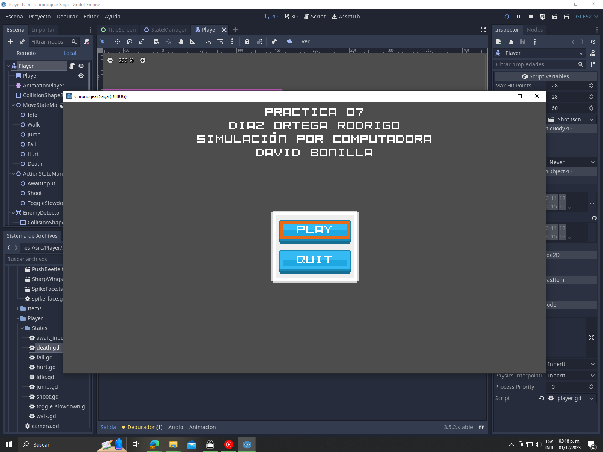
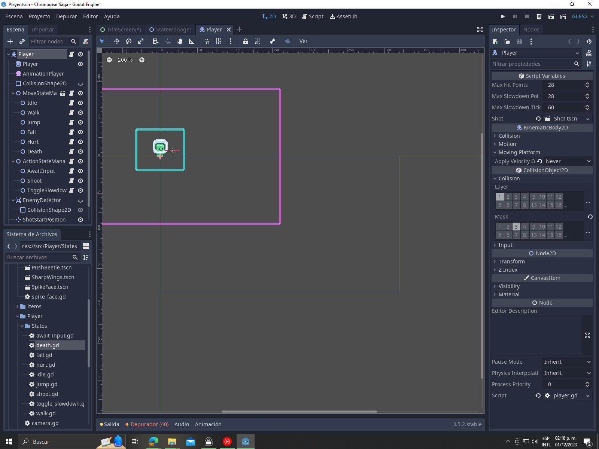

# Práctica 7: Juego 2D en Godot
En este apartado se muestra el desarrollo de la séptima práctica.

Los objetivos cumplidos fueron:

+ Tener por lo menos estas mecánica  de jugador  (que se pueda desplazar por el escenario, que pueda recolectar objetos, que pueda brincar)
+ 3 escenarios que reasenten niveles (Nomás hay 2:C)
+ Tener un ventana de termina de juego
+ Sonidos para las mecánicas y de ambientación 
+ Recolección de objetos
+ Power-up que se activa por algún evento (Disparos con la barra espaciadora)

## Evidencia 1

## Evidencia 2
